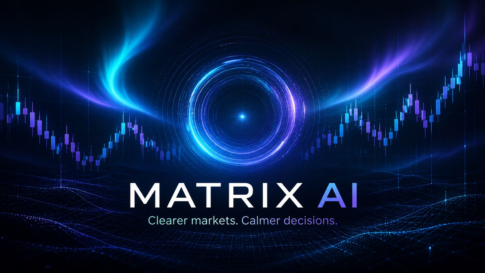

# Matrix AI — private market research system

**An in-progress, local-first dashboard for market observation, virtual signal research, and guarded demo practice.**



Matrix AI explores how to present complex market information clearly while keeping account actions behind explicit safeguards. The working dashboard runs on one Windows computer and reads a sanitized local feed from MetaTrader 5. This is a **project case study**; the private trading engine, account connection, credentials, and research data are not published here.

## The problem

Market tools often show prices, signals, account status, and risk in separate places. Matrix AI brings those views together so a user can see what information is fresh, what is uncertain, and why a setup is allowed or held.

## What has been built

- A responsive dashboard with views for market exploration, opportunities, events, signal research, practice results, safety settings, and system status.
- Candlestick charts with multiple visible ranges, zoom, pan, crosshair values, and EMA overlays.
- A separate research path that evaluates captured signals in virtual ledgers and retains an evidence trail.
- Demo-only practice controls with loss, exposure, position, data-freshness, and market-event safeguards.
- Local adapters that expose sanitized summaries to the dashboard while leaving credentials and raw account data outside the web interface.

## System design

```text
MetaTrader 5 demo feed → local bridge → sanitized dashboard data → React dashboard
                                   ↘ virtual signal research → local evidence store
```

The interface uses React and TypeScript. The private bridge and evidence store run locally. The dashboard is bound to the computer's loopback address; it is not a hosted trading service.

## Current status and boundaries

Matrix AI is still in development. The public description documents the design and current local prototype, not a production launch or investment result. Signals are research inputs, not promises of profit. Real-account execution remains blocked. The AI-branded cover above is concept artwork, not a screenshot of live trading performance.

The public case study omits account details, Telegram credentials, raw messages, trade journals, and the private execution and strategy code.
